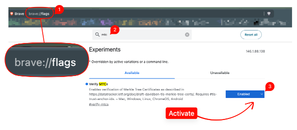

# PQC TLS Demo

A self-contained demo showing three eras of TLS certificate authentication side by side — from today's hybrid transition to the future Merkle Tree Certificate (MTC) architecture that Chrome and Cloudflare are building.

## What this demonstrates

| Port     | Mode           | CA Signature                        | Proof Size       | Who can verify                                 |
| -------- | -------------- | ----------------------------------- | ---------------- | ---------------------------------------------- |
| **4443** | Hybrid X.509   | RSA primary + ML-DSA-65 alternative | ~2 KB cert chain | All browsers (RSA), PQC-aware clients (ML-DSA) |
| **4444** | Pure PQC X.509 | ML-DSA-65 (FIPS 204)                | ~4 KB cert chain | PQC-aware clients only (OpenSSL 3.6+)          |
| **4445** | MTC proof      | ML-DSA-65 + Merkle inclusion proof  | ~768 bytes       | `mtc-tls-verify` tool, future browsers         |

### Why three modes?

**Hybrid (port 4443)** is the migration-safe approach recommended today. Legacy browsers verify the RSA signature normally. PQC-aware clients also verify the ML-DSA-65 alternative signature carried in an X.509 v3 extension. This is backwards-compatible — no client breaks.

**Pure PQC (port 4444)** uses ML-DSA-65 as the primary (and only) CA signature. Full quantum resistance, but legacy browsers show "Not Secure" because they cannot verify ML-DSA-65. This represents the end state once all clients support PQC.

**MTC (port 4445)** is the next-generation approach being developed by Google and Cloudflare. Instead of sending a full certificate chain, the server staples a compact Merkle inclusion proof (~768 bytes) into the TLS handshake. The proof demonstrates that the certificate exists in a transparency log, replacing the traditional signature verification with a hash-based proof. This is how Chrome plans to deliver post-quantum authentication without the bandwidth penalty of ML-DSA signatures (~14.7 KB per handshake).

## Architecture

```
                     EJBCA CE (SoftHSMv3 + kimbo11ng)
                     ├── Hybrid-RootCA (RSA + ML-DSA-65)
                     └── PQC-RootCA (ML-DSA-65)
                              │
              ┌───────────────┼───────────────┐
              │               │               │
              ▼               ▼               ▼
         nginx :4443     nginx :4444    mtc-tls-server :4445
         Hybrid X.509    Pure PQC       PQC cert + MTC proof
                                              ▲
                                              │ GET /assertion/{serial}
                                              │
                                        mtc-bridge-ejbca :8080
                                        ├── polls EJBCA REST API
                                        ├── builds Merkle tree
                                        └── generates inclusion proofs
```

### Components

| Service            | Image                            | Purpose                                                          |
| ------------------ | -------------------------------- | ---------------------------------------------------------------- |
| **postgres**       | `postgres:16-alpine`             | EJBCA database                                                   |
| **ejbca**          | `ghcr.io/thpham/ejbca-ce:latest` | Certificate Authority with PQC support (SoftHSMv3 + OpenSSL 3.6) |
| **nginx**          | Built from `Dockerfile.nginx`    | Web server compiled against OpenSSL 3.6 for PQC TLS              |
| **mtc-postgres**   | `postgres:16-alpine`             | MTC bridge state store (Merkle tree, checkpoints, assertions)    |
| **mtc-bridge**     | `mtc-bridge-ejbca:latest`        | Polls EJBCA REST API, builds Merkle tree, serves proofs          |
| **mtc-tls-server** | `mtc-bridge-ejbca:latest`        | TLS server that staples MTC inclusion proofs into handshakes     |

## Quick start

### Prerequisites

- Docker
- [just](https://github.com/casey/just) command runner
- The `mtc-bridge-ejbca` Docker image (built from the [ca-extension-mtc-playground](https://github.com/thpham/ca-extension-mtc-playground) repo)

### Build the MTC bridge image (one-time)

```bash
cd ../ca-extension-mtc-playground
git checkout feat/ejbca-adapter
docker build -f Dockerfile.ejbca -t mtc-bridge-ejbca:latest .
cd ../kimbo11ng
```

### Run the demo

```bash
just demo up
```

This takes ~4 minutes on first run (EJBCA startup + CA provisioning + MTC indexing). The script:

1. Starts EJBCA + PostgreSQL + nginx
2. Provisions admin credentials and HSM token
3. Creates a Hybrid Root CA (RSA + ML-DSA-65) and a Pure PQC Root CA (ML-DSA-65)
4. Patches EJBCA's CA data for the alternative signature algorithm
5. Issues server certificates from both CAs
6. Starts the MTC bridge, which polls EJBCA's REST API and builds a Merkle tree
7. Starts the MTC TLS server, which staples inclusion proofs into TLS handshakes

### Verify

```bash
# Verify MTC proof end-to-end
just demo verify

# Inspect hybrid certificate (RSA + ML-DSA-65 alt sig)
docker compose -f demo/docker-compose.demo.yml exec nginx \
  openssl s_client -connect localhost:443 </dev/null 2>/dev/null | openssl x509 -text -noout

# Inspect pure PQC certificate (ML-DSA-65 primary)
docker compose -f demo/docker-compose.demo.yml exec nginx \
  openssl s_client -connect localhost:4444 </dev/null 2>/dev/null | openssl x509 -text -noout
```

### Teardown

```bash
just demo down
```

## Understanding the certificates

### Hybrid certificate (port 4443)

```
Signature Algorithm: sha256WithRSAEncryption     ← primary (all clients)
X509v3 Alternative Signature Algorithm: ML-DSA-65 ← PQC (extension)
X509v3 Alternative Signature Value: <ML-DSA sig>  ← verified by PQC-aware clients
```

The server key is RSA-2048 (for TLS handshake compatibility). The CA signs with both RSA and ML-DSA-65. Legacy browsers verify the RSA chain and ignore the ML-DSA extension. PQC-aware clients verify both.

### Pure PQC certificate (port 4444)

```
Signature Algorithm: ML-DSA-65     ← only signature, no RSA fallback
```

The CA signature is pure post-quantum. Go's `x509.ParseCertificate` and legacy browsers cannot parse this. Only clients with ML-DSA support (OpenSSL 3.6+) can verify it.

### MTC proof (port 4445)

The same PQC certificate is served, but with a Merkle Tree inclusion proof stapled via the `SignedCertificateTimestamps` TLS extension:

```
Leaf Index:  1
Tree Size:   7
Proof Depth: 3
Proof Size:  ~768 bytes
```

Instead of verifying the CA signature directly, the client verifies that the certificate is included in a transparency log by checking the Merkle proof against a known checkpoint.

## Why MTC matters for post-quantum TLS

Replacing today's TLS signatures with ML-DSA-65 would balloon authentication data from ~1.2 KB to ~14.7 KB — a 12x increase that exceeds TCP's initial congestion window and causes 60%+ handshake latency slowdowns.

Merkle Tree Certificates solve this by replacing per-certificate signatures with compact hash-based inclusion proofs:

| Approach           | Auth data size | Round trips                     |
| ------------------ | -------------- | ------------------------------- |
| Today (ECDSA)      | ~1.2 KB        | 1                               |
| ML-DSA-65 in X.509 | ~14.7 KB       | 2-3 (exceeds congestion window) |
| MTC proof          | ~768 bytes     | 1                               |

Google announced in February 2026 that Chrome will **not** add post-quantum X.509 certificates to the Chrome Root Store. Instead, the Chrome Quantum-resistant Root Store (CQRS), planned for Q3 2027, will only support MTCs.

## Browser support

### Current status (April 2026)

Brave and Chrome have an experimental flag to enable MTC verification:

```
brave://flags/#verify-mtcs    (or chrome://flags/#verify-mtcs)
```



This flag enables verification of Merkle Tree Certificates as described in [draft-ietf-plants-merkle-tree-certs](https://datatracker.ietf.org/doc/draft-ietf-plants-merkle-tree-certs/). It requires the `#tls-trust-anchor-ids` flag.

However, enabling this flag alone is **not sufficient** to verify our demo's MTC proofs. Chrome/Brave only trust MTC logs that are registered in their hardcoded trust store (currently only Cloudflare's experimental log). Our bridge uses `localhost/mtc-bridge-ejbca` as the log origin, which browsers don't recognize.

### Path to browser verification

| Timeline    | Milestone                                                              |
| ----------- | ---------------------------------------------------------------------- |
| **Now**     | `just demo verify` (uses `mtc-tls-verify` inside the container)        |
| **2026**    | Chrome Phase 1 — experimental with Cloudflare only                     |
| **Q1 2027** | Phase 2 — CT log operators onboarded, DNS-based trust anchor discovery |
| **Q3 2027** | Phase 3 — Chrome Quantum-resistant Root Store (CQRS) launched          |

The most promising path for custom/local MTC verification is [DNS-based Trust Anchor IDs](https://issues.chromium.org/issues/415720499) — once implemented, browsers could discover our bridge's log origin via DNS records rather than requiring hardcoded trust.

### Can we point Chrome/Brave at our custom MTC log?

**No — not with current builds.** We verified this by examining the [Chromium source code](https://github.com/chromium/chromium/blob/main/chrome/browser/component_updater/pki_metadata_component_installer.cc):

The `kVerifyMTCs` feature flag (`brave://flags/#verify-mtcs`) only enables/disables MTC verification — it has **no parameters** for specifying custom log origins or trust anchors. MTC trust data is loaded from a signed protobuf delivered by Google's Component Updater infrastructure:

```
Google Component Updater → protobuf on disk → TrustStoreChrome → hardcoded MTC anchors
```

There is no `--custom-mtc-log` or similar command-line flag. The `CreateForTesting()` method exists in the source but is only accessible from C++ unit tests, not from the browser UI.

**Override paths (all require significant effort):**

| Approach                         | Difficulty            | Description                                                                                                                                              |
| -------------------------------- | --------------------- | -------------------------------------------------------------------------------------------------------------------------------------------------------- |
| Intercept Component Updater data | Hard                  | Replace the PKI metadata protobuf on disk with a custom one containing our log origin. Requires crafting a valid `RootStore` proto with `MtcAnchorData`. |
| Build Chromium from source       | Hard                  | Add our log origin to the compiled-in root store and build. Most reliable but heaviest.                                                                  |
| DNS Trust Anchor IDs             | Easy (when available) | [Chromium issue #415720499](https://issues.chromium.org/issues/415720499) — serve our trust anchor via local DNS record. No custom build needed.         |

For now, `just demo verify` using `mtc-tls-verify` inside the container performs the same cryptographic verification that Chrome will eventually do natively.

### Firefox: a potentially more open path for PQC verification

Mozilla has made no announcement about MTC support. However, Firefox may offer an easier path for verifying PQC certificates directly, without the MTC indirection.

**NSS (Firefox's crypto library) is actively adding ML-DSA support.** [NSS 3.121](https://firefox-source-docs.mozilla.org/security/nss/releases/nss_3_121.html) (February 2026) includes ML-DSA bug fixes, indicating that ML-DSA code is landing in the certificate verification stack.

| Feature                  | Chrome/Brave                           | Firefox                                       |
| ------------------------ | -------------------------------------- | --------------------------------------------- |
| Custom CA trust          | System store only, no MTC override     | `certutil` + PKCS#11 modules + `about:config` |
| ML-DSA cert verification | Refused — chose MTC path instead       | NSS adding support (in progress)              |
| MTC verification         | Hardcoded log origins (no custom logs) | No MTC support                                |

If NSS completes ML-DSA X.509 chain verification, Firefox could verify our pure PQC certificate directly:

```bash
# Import our PQC Root CA into Firefox's trust store
certutil -A -n "PQC-RootCA" -t "CT,C,C" -i demo/certs/pqc-ca.pem -d ~/.mozilla/firefox/<profile>/

# Then browse to https://localhost:4444/ — Firefox verifies ML-DSA-65 natively
```

This would bypass the MTC layer entirely — standard X.509 trust with a PQC signature algorithm. No hardcoded log origins, no protobuf, no component updater. Just add the CA and trust its certs.

**Current status:** NSS 3.121 has ML-DSA code but full X.509 chain verification may not be enabled yet. Track progress via [NSS release notes](https://firefox-source-docs.mozilla.org/security/nss/index.html) and [Mozilla Bugzilla](https://bugzilla.mozilla.org/).

## How the MTC bridge works

The [ca-extension-mtc-playground](https://github.com/thpham/ca-extension-mtc-playground) repo contains an EJBCA REST API adapter for DigiCert's MTC bridge. It replaces the original MariaDB polling with EJBCA's `/v1/certificate/search` endpoint:

```
EJBCA issues cert
    ↓  REST API (mTLS, poll every 10s)
mtc-bridge-ejbca
    ↓  SHA-256 leaf hash
Merkle tree (PostgreSQL)
    ↓  Ed25519 signed checkpoint (every 30s)
Assertion bundle (inclusion proof)
    ↓  GET /assertion/{serial}
mtc-tls-server
    ↓  stapled into TLS handshake (SCT extension)
Client verifies proof against checkpoint
```

The adapter is designed as a **zero-conflict fork** of the upstream DigiCert repo — all EJBCA code lives in new files (`internal/ejbca/`, `internal/casource/`, `cmd/mtc-bridge-ejbca/`), and upstream files are never modified. Syncing with upstream is a clean `git rebase`.

## References

- [IETF draft-ietf-plants-merkle-tree-certs-02](https://datatracker.ietf.org/doc/draft-ietf-plants-merkle-tree-certs/) — MTC specification
- [Cloudflare: Introducing Merkle Tree Certificates](https://blog.cloudflare.com/bootstrap-mtc/) — Cloudflare's MTC implementation
- [Google's MTC announcement](https://postquantum.com/security-pqc/googles-merkle-tree-mtc-https/) — Chrome's roadmap to CQRS
- [DigiCert MTC Playground](https://github.com/digicert/ca-extension-mtc-playground) — upstream MTC bridge
- [IETF TLS Trust Anchor Identifiers](https://datatracker.ietf.org/doc/draft-ietf-tls-trust-anchor-ids/) — trust anchor negotiation for MTC
- [Chromium: DNS Trust Anchor IDs](https://issues.chromium.org/issues/415720499) — future browser discovery mechanism
- [NIST FIPS 204 (ML-DSA)](https://csrc.nist.gov/pubs/fips/204/final) — Module-Lattice-Based Digital Signature Standard
